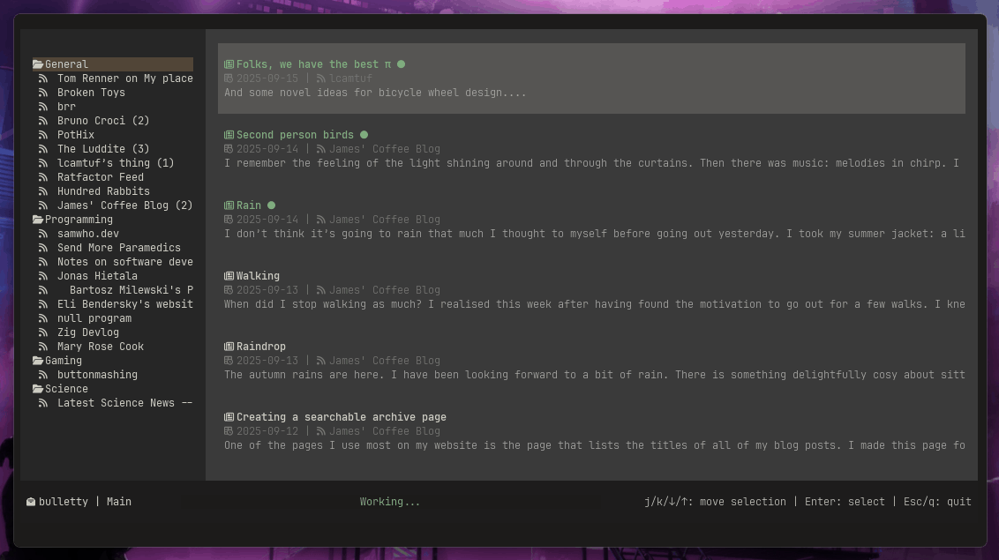

<h1 align="center">📰 bulletty</h1>
<p align="center">The TUI RSS/ATOM feed reader that lets you decide where to store your data.</p>

<p align="center">
  
</p>

**bulletty** is a TUI feed reader (RSS and ATOM). Read your subscriptions within your terminal. It downloads the entries for offline reading so all the data is local and yours: your subscriptions, highlights, comments, etc. All in an universal format: Markdown. Backup and sync your `data` directory your own way. 

It's in active development.

## 🔨 Features

 - Subscribe to RSS and ATOM feed types
 - All your feed sources and entries are stored in Markdown in one place: `$HOME/.local/share/bulletty/`
 - Download entries automatically
 - Add articles to the Read Later category
 - Read the articles with the embedded Markdown reader
 - Import/export OPML feed list

## 🚀 Install

[Download bulletty pre-built binaries](https://github.com/CrociDB/bulletty/releases)

### 🚚 Through Cargo

It requires **cargo 1.90+**:

```shell
cargo install bulletty
```

### ☂️ Pre-requisites

**bulletty** runs in most platforms, however there are some pre-requisites to have it run the best way possible:

- Use a modern terminal emulator such as **Kitty**, **Ghostty**, **Alacritty**, **WezTerm**, **Windows Terminal**, etc. They provide modern features and true color support, on top of being really fast and usually hardware-redered
- Use a [NerdFont](http://nerdfonts.com/). They are patched versions of common coding fonts with several icons

## 🚄 Usage

### 🗞️ Adding new feed sources

For now, you can only add new feed sources through the CLI:

```shell
bulletty add https://crocidb.com/index.xml [Category]
```

If no category is passed, the feed source will be added to the `General` category. **bulletty** will syncronize all your sources when you open the TUI, by just invoking `bulletty`.

More on the CLI commands with:

```shell
bulletty help
```

### 🧩 TUI

On any screen, you can press question mark `?` and it will show you the available commands for that screen. Also, on the bottom right, it shows the most important commands for that context.

In general, it supports `j/k/up/down` to select items, navigate and scroll, as well as `g/G/Home/End` to go to the begginning/end of a list or file and `Enter` and `q/Esc` to navigate into and out of Categories and Entries. In order to open an Entry externally, press `o`.

## 🏫 Philosophy

The whole idea is bringing back the descentralized internet. You subscribe to the sources you like the most and you get their content whenever it's available. When you get it, it's local, it's yours. **bulletty** will generate a Markdown file of each entry from each source. You can read through the embedded reader, straight from your terminal, or using any text editor.

All your feed data will be at `$HOME/.local/share/bulletty/`, in this structure:

```shell
[~/.local/share/bulletty]$ tree
.
└── categories
    ├── Programming
    │   ├── bruno-croci
    │   │   ├── .feed.toml
    │   │   ├── about.md
    │   │   ├── demystifying-the-shebang-kernel-adventures.md
    │   │   ├── from-ides-to-the-terminal.md
    │   │   ├── i-wrote-a-webserver-in-haskell.md
    │   │   ├── ...
    ├── General
    │   ├── another-website
    │   │   ├── .feed.toml
    │   │   ├── some-post.md
    │   │   ├── ...

```

All the needs to be done is to synchronize the `bulletty` directory to save your data, similarly to an Obsidian vault.

## 📜 Feature Roadmap

 - Themes
 - Highlight
 - Notes
 - Web view
 - Mouse support
 - Image support

## 💻 Build

```shell
git clone https://github.com/CrociDB/bulletty.git
cd bulletty
cargo build --release
```

## 👩‍💻 Contributing to bulletty

I am very open for contributions to help make **bulletty** the best feed reader out there. For more information on how to contribute, refer to the **CONTRIBUTING.md**.

## 📃 License

Copyright (c) Bruno Croci

This project is licensed under the MIT license ([LICENSE] or <http://opensource.org/licenses/MIT>)

[LICENSE]: ./LICENSE
